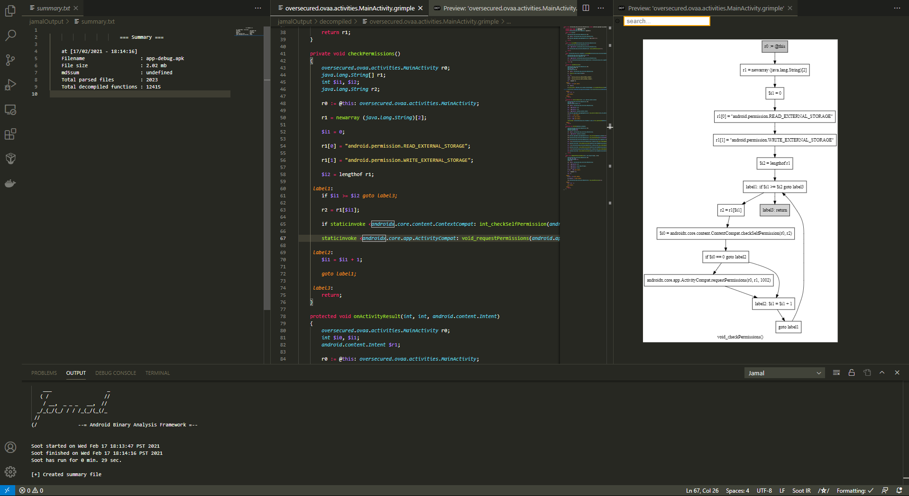
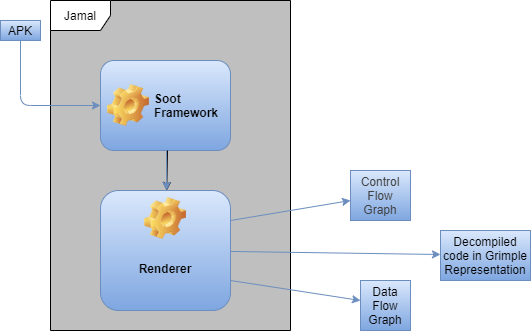

# Jamal

Visual Studio Code extension for aiding in android mobile application analysis.

Jamal is mainly a wrapper around a *slightly* modified [Soot Framework](https://github.com/soot-oss/soot) with extra rendering for recovering Control Flow.

Given an android application `APK file`, Jamal aids in decompilation and static analysis by producing `Grimple files` which are an aggregated version of a typed `3-address intermediate representation` suitable for code inspection.

*Please report any bugs you encounter.*

## Overview

## Architecture

## Quick Start

1. Start new project
2. Right click on the desired APK file, as an example I am using the [Oversecured Vulnerable Android App](https://github.com/oversecured/ovaa) select `Run analysis`.
3. Wait for soot engine to finish decompilation and analysis.
4. Result will be generated in `jamalOutput` folder in your current workspace.

## Features

### Dynamic Control Flow Graph inspection 

### Syntactic and Semantic support for Soot IR

### Graphviz Dot Representation 

Exportable dot representation of the recovered Control Flow Graph.

## Known issues

Jamal can run out of memory when analysing big APK files, please allocate more memory for the JVM from the extension settings.

## Requirements

Jamal depends on:
* [Java](https://www.oracle.com/java/technologies/javase/jdk15-archive-downloads.html)
* [Android Platforms](https://github.com/Sable/android-platforms)
* [tintinweb Interactive Graphviz](https://github.com/tintinweb/vscode-interactive-graphviz)

## Release Notes

**[CHANGELOG](./CHANGELOG.md)**

